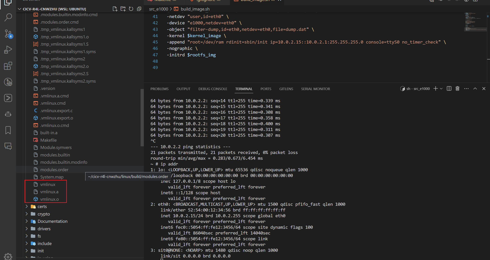
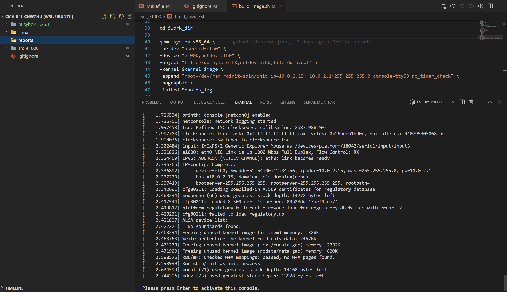
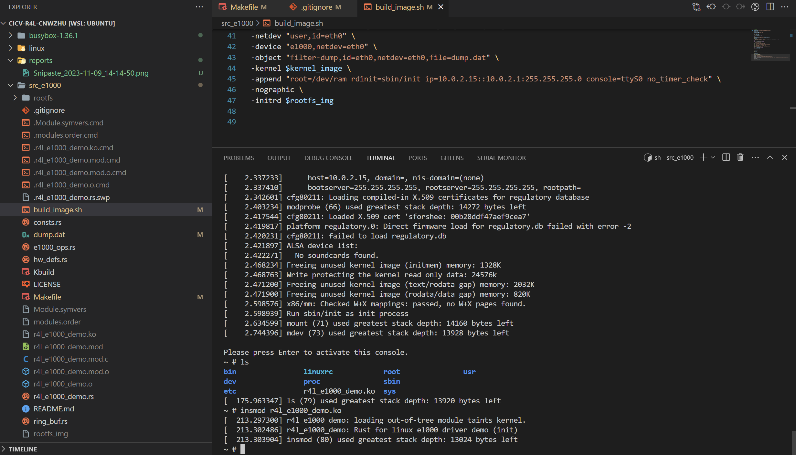
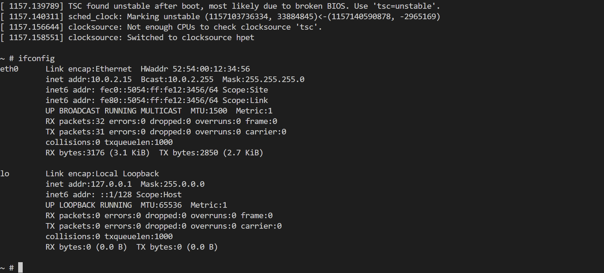
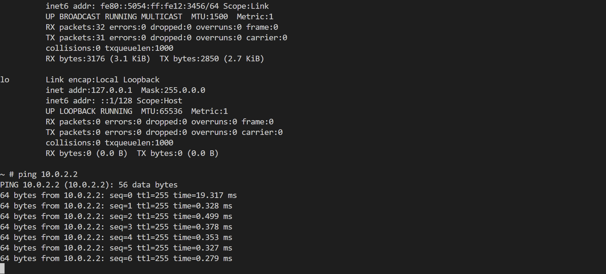
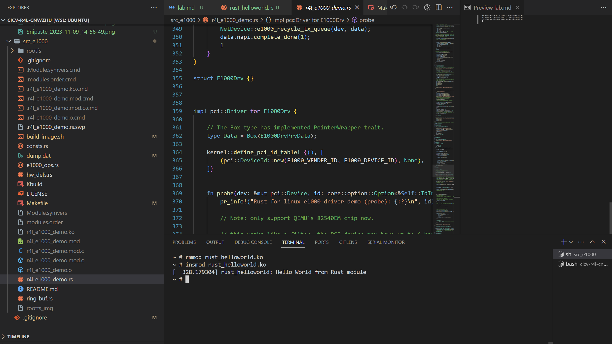

# 课程作业
## 作业一
- 下载代码
```
git clone git@github.com:cicvedu/cicv-r4l-cnwzhu.git
```
- 配置环境
```
curl --proto '=https' --tlsv1.2 -sSf https://sh.rustup.rs | sh

sudo apt-get -y install \
  binutils build-essential libtool texinfo \
  gzip zip unzip patchutils curl git \
  make cmake ninja-build automake bison flex gperf \
  grep sed gawk bc \
  zlib1g-dev libexpat1-dev libmpc-dev \
  libglib2.0-dev libfdt-dev libpixman-1-dev libelf-dev libssl-dev

sudo apt-get install clang-format clang-tidy clang-tools clang clangd libc++-dev libc++1 libc++abi-dev libc++abi1 libclang-dev libclang1 liblldb-dev libllvm-ocaml-dev libomp-dev libomp5 lld lldb llvm-dev llvm-runtime llvm python3-clang

cd /cicv-r4l-cnwzhu/linux

rustup override set $(scripts/min-tool-version.sh rustc)

rustup component add rust-src

# 老版本
cargo install --locked --version $(scripts/min-tool-version.sh bindgen) bindgen

# 新版本
cargo install --locked --version $(scripts/min-tool-version.sh bindgen) bindgen-cli

rustup component add rustfmt

rustup component add clippy

make LLVM=1 rustavailable

```
- 编译
```
make LLVM=1 O=build defconfig
make LLVM=1 O=build menuconfig
#set the following config to yes
General setup
        ---> [*] Rust support

make LLVM=1 O=build -j16
```
- 结果
[](./Snipaste_2023-11-09_14-21-08.png)

## 作业二
### 编译成内核模块，是在哪个文件中以哪条语句定义的
src_e1000/Makefile 中定义的 \$\(MAKE\) -C \$(KDIR) M=$$PWD
src_e1000/Kbuild中的 obj-m += e1000.o

### 该模块位于独立的文件夹内，却能编译成Linux内核模块，这叫做out-of-tree module，请分析它是如何与内核代码产生联系的
这是通过Makefile和Kbuild系统实现的。，src_e1000/Makefile中的\$(MAKE) -C $(KDIR) M=\$$PWD语句告诉make命令在$(KDIR)目录（通常是内核源代码目录）中执行，但是所有的输出（包括.o文件和.mod文件）都应该在当前目录（$$PWD）中生成。
同时，src_e1000/Kbuild中的obj-m += e1000.o语句告诉Kbuild系统，它应该为e1000.o文件生成一个模块
### 构建结果
[](./Snipaste_2023-11-09_14-14-50.png)
[](./Snipaste_2023-11-09_14-17-13.png)
[](./Snipaste_2023-11-09_14-56-30.png)
[](./Snipaste_2023-11-09_14-56-49.png)

## 作业三
### 过程
```
在linux/sample/rust目录中创建rust_helloworld.rs

修改linux/sample/Makefile，添加rust_helloworld模块
obj-$(CONFIG_SAMPLE_RUST_HELLOWORLD)		+= rust_helloworld.o

修改linux/sample/Kconfig，添加rust_helloworld模块
config SAMPLE_RUST_HELLOWORLD
	tristate "Hello World module"
	help
	  This option builds the Rust Hello World module sample.

	  To compile this as a module, choose M here:
	  the module will be called rust_helloworld.

	  If unsure, say N.

执行 make LLVM=1 O=build menuconfig，选择rust_helloworld模块
执行 make LLVM=1 O=build -j16，编译内核

拷贝 linux/build/sample/rust/rust_helloworld.ko 到 src_e1000/rootfs
执行 ./build_image.sh

执行 insmod rust_hellowrold.ko

```
### 结果
[](./Snipaste_2023-11-09_15-21-16.png)